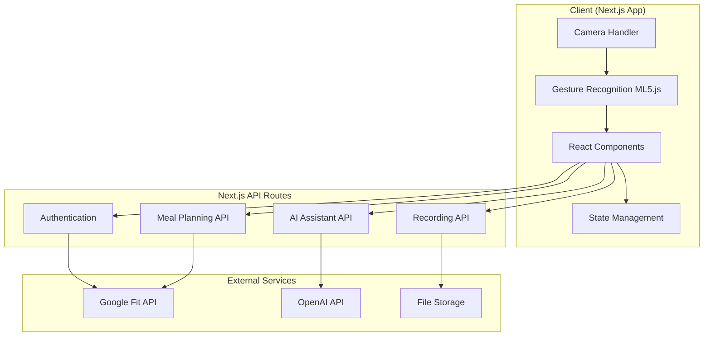

# Design Document

## Overview

VeCook is a Next.js-based AI cooking assistant that provides personalized, hands-free cooking guidance with a caring, mom-like personality. The application leverages modern React patterns, ML5.js for gesture recognition, Google Fit API for health data, and OpenAI for intelligent assistance. The design prioritizes user experience, accessibility, and seamless integration of AI-powered features.

## Architecture

### High-Level Architecture



### Technology Stack

- **Frontend Framework**: Next.js 15.5+ with App Router
- **Runtime**: React 19.1 with TypeScript
- **Styling**: Tailwind CSS 4
- **Machine Learning**: ML5.js for gesture recognition
- **AI Integration**: OpenAI API for conversational assistance
- **Health Data**: Google Fit API
- **State Management**: React Context + useReducer
- **Authentication**: Optional Google OAuth for Google Fit API access
- **Local Storage**: Browser localStorage for user preferences and session data
- **Deployment**: Vercel

## Components and Interfaces

### Core Components

#### 1. Layout Components
- **RootLayout** (`app/layout.tsx`): Global layout with providers
- **CookingLayout** (`app/cooking/layout.tsx`): Cooking-specific layout with gesture controls
- **Navigation**: Responsive navigation with cooking mode toggle

#### 2. Cooking Interface Components
- **RecipeViewer**: Displays current recipe step with large, readable text
- **GestureController**: Handles ML5.js integration and gesture recognition
- **StepNavigator**: Visual step indicator with progress tracking
- **AIAssistant**: Chat interface for real-time cooking help
- **HandRaiseDetector**: Specialized component for detecting help gestures

#### 3. Meal Planning Components
- **MealPlanner**: Main meal planning interface
- **ActivityIntegration**: Google Fit data display and sync
- **RecipeRecommendations**: AI-powered recipe suggestions
- **DietaryPreferences**: User preference management
- **NutritionCalculator**: Portion adjustment based on activity

#### 4. Content Creation Components
- **RecordingController**: Video recording management
- **RecordingPreview**: Preview and editing interface
- **SocialSharer**: Multi-platform sharing with optimized formats
- **RecipeExporter**: Export recipes with cooking videos

### API Interface Design

#### Authentication Endpoints (Optional)
```typescript
// app/api/auth/google/route.ts
POST /api/auth/google - Optional Google OAuth for Fit API access
GET /api/auth/status - Check Google Fit connection status
```

#### Meal Planning Endpoints
```typescript
// app/api/meals/route.ts
GET /api/meals/recommendations - Get personalized meal recommendations
POST /api/meals/preferences - Update dietary preferences
GET /api/meals/activity - Sync Google Fit activity data

// app/api/meals/[id]/route.ts
GET /api/meals/[id] - Get specific meal details
PUT /api/meals/[id] - Update meal portions based on activity
```

#### AI Assistant Endpoints
```typescript
// app/api/ai/chat/route.ts
POST /api/ai/chat - Send message to AI assistant
GET /api/ai/chat/history - Get conversation history

// app/api/ai/help/route.ts
POST /api/ai/help - Request cooking assistance with context
```

#### Recording Endpoints
```typescript
// app/api/recording/route.ts
POST /api/recording/process - Process recorded video client-side
GET /api/recording/formats - Get optimized formats for sharing
```

## Data Models

### User Model (Local Storage)
```typescript
interface UserPreferences {
  googleFitConnected: boolean;
  dietaryPreferences: DietaryPreference[];
  activityLevel: ActivityLevel;
  lastUpdated: Date;
}

interface DietaryPreference {
  type: 'allergy' | 'preference' | 'restriction';
  value: string;
  severity?: 'mild' | 'moderate' | 'severe';
}

type ActivityLevel = 'sedentary' | 'light' | 'moderate' | 'active' | 'very_active';
```

### Recipe Model
```typescript
interface Recipe {
  id: string;
  title: string;
  description: string;
  steps: RecipeStep[];
  ingredients: Ingredient[];
  nutrition: NutritionInfo;
  difficulty: 'easy' | 'medium' | 'hard';
  cookingTime: number; // minutes
  servings: number;
  tags: string[];
}

interface RecipeStep {
  id: string;
  stepNumber: number;
  instruction: string;
  duration?: number; // minutes
  temperature?: number;
  tips?: string[];
  imageUrl?: string;
}

interface Ingredient {
  name: string;
  amount: number;
  unit: string;
  alternatives?: string[];
}
```

### Cooking Session Model (Session Storage)
```typescript
interface CookingSession {
  recipeId: string;
  currentStep: number;
  startTime: Date;
  endTime?: Date;
  adjustedPortions: number;
  aiInteractions: AIInteraction[];
  recordingBlob?: Blob;
  status: 'active' | 'paused' | 'completed' | 'abandoned';
}

interface AIInteraction {
  timestamp: Date;
  userMessage: string;
  aiResponse: string;
  context: 'help_request' | 'mistake_fix' | 'general_question';
}
```

### Gesture Recognition Model
```typescript
interface GestureState {
  isActive: boolean;
  currentGesture: GestureType | null;
  confidence: number;
  lastDetected: Date;
}

type GestureType = 'point_right' | 'point_left' | 'hand_raise' | 'thumbs_up' | 'stop';

interface GestureConfig {
  sensitivity: number;
  cooldownMs: number;
  requiredConfidence: number;
}
```

## Error Handling

### Client-Side Error Handling
- **Gesture Recognition Failures**: Fallback to touch/click navigation
- **Camera Access Denied**: Show manual navigation with clear instructions
- **Network Connectivity**: Offline mode with cached recipes and local storage
- **ML5.js Loading Failures**: Progressive enhancement with manual controls

### API Error Handling
- **Google Fit API Errors**: Graceful degradation with manual activity input
- **OpenAI API Errors**: Fallback to pre-defined cooking tips and troubleshooting
- **Rate Limiting**: Queue requests and show appropriate user feedback
- **Authentication Failures**: Clear re-authentication flow

### Error Boundary Implementation
```typescript
// components/ErrorBoundary.tsx
class CookingErrorBoundary extends React.Component {
  // Handle gesture recognition and cooking-specific errors
  // Provide cooking-safe fallback UI
}

class GlobalErrorBoundary extends React.Component {
  // Handle application-wide errors
  // Maintain cooking session state during errors
}
```

## Testing Strategy

### Unit Testing
- **Component Testing**: React Testing Library for all UI components
- **Gesture Recognition**: Mock ML5.js for consistent testing
- **API Routes**: Jest testing for all Next.js API endpoints
- **Utility Functions**: Comprehensive testing for cooking calculations and conversions

### Integration Testing
- **Gesture Flow**: End-to-end gesture navigation testing
- **AI Integration**: Mock OpenAI responses for consistent testing
- **Google Fit Integration**: Mock API responses and test data synchronization
- **Recording Workflow**: Test complete recording and sharing flow

### E2E Testing
- **Cooking Session**: Complete cooking workflow from recipe selection to completion
- **Cross-Device**: Test responsive behavior and gesture recognition across devices
- **Accessibility**: Screen reader compatibility and keyboard navigation
- **Performance**: Load testing for video recording and AI response times

### Testing Tools
- **Unit/Integration**: Jest + React Testing Library
- **E2E**: Playwright for cross-browser testing
- **Visual Regression**: Chromatic for UI consistency
- **Performance**: Lighthouse CI for performance monitoring
- **Accessibility**: axe-core for accessibility testing

### Test Data Strategy
- **Mock Recipes**: Comprehensive recipe database for testing
- **Gesture Simulation**: Synthetic gesture data for ML5.js testing
- **User Scenarios**: Various user profiles with different dietary needs
- **Error Scenarios**: Comprehensive error condition testing

## Performance Considerations

### Optimization Strategies
- **Code Splitting**: Route-based and component-based splitting
- **Image Optimization**: Next.js Image component for recipe images
- **ML5.js Loading**: Lazy loading and progressive enhancement
- **API Caching**: SWR for client-side caching and revalidation
- **Video Optimization**: Compressed video formats and streaming

### Monitoring
- **Core Web Vitals**: LCP, FID, CLS monitoring
- **Gesture Recognition Performance**: Latency and accuracy metrics
- **AI Response Times**: OpenAI API performance tracking
- **User Experience**: Cooking session completion rates and user feedback